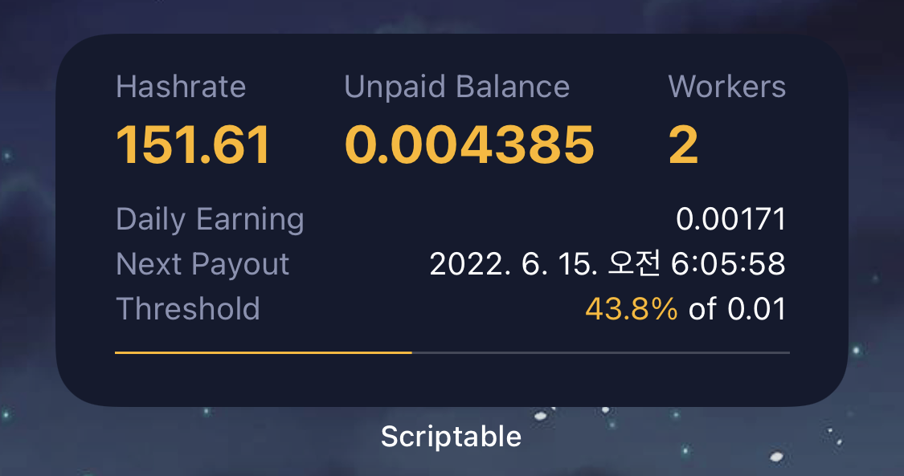

# scriptable-ethermine.js

 A Scriptable widget that shows the current ethermine status based on ethermine.org API.

 

 <p>
   <a href="#setup">Setup</a> •
   <a href="#usage">Usage</a> •
   <a href="#contribution">Contribution</a> •
 </p>

 ## Setup

 1. (if not done yet) Download the scriptable app form [AppStore](https://apps.apple.com/de/app/scriptable/id1405459188)
 2. In Scriptable create a new script
 3. Copy the code from script file [scriptable-ethermine.js](https://github.com/daesuni/scriptable-ethermine.js/blob/main/scriptable-ethermine.js)
 4. Create a new widget on homescreen and select this script in scriptable

 ## Usage
 ### Change displayed currency

 You must change your EDMIN address on line 2. <br>

 ```javascript
 // ENTER YOUT MINING ADDRESS
 const address = 'YOUR ETHERMINE ADDRESS HERE'
 ```

 ## Contribution

 If you have any ideas for extensions or changes just let me know.
